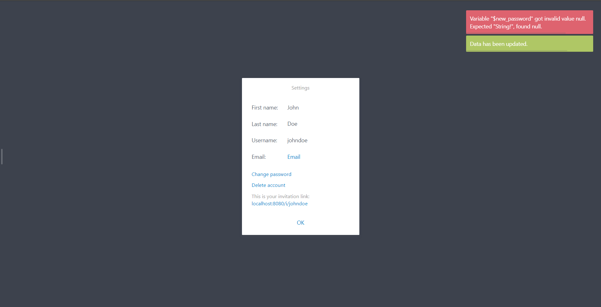

# Vue Notice

Vue.js non-blocking notifications, based on [Noty.js](https://ned.im/noty)



## How to start

1) Install in your project

```sh
npm i @marcius-studio/vue-notice
yarn add @marcius-studio/vue-notice
```

2) Import as plugin. Full list [Noty API](https://ned.im/noty/#/options) options.

```js
import Vue from 'vue'
import VueNotice from '@marcius-studio/vue-notice'

Vue.use(VueNotice)

// OR rewrite default options
Vue.use(VueNotice, {
  layout: 'topRight', // position: 'top', 'topLeft', etc. https://ned.im/noty/#/types
	theme: 'mint', // deffrents themes https://ned.im/noty/#/themes
	timeout: 5000, // default 5s. Set 0 if need no countdown, can be override for each notice
	progressBar: true,
})

```

3) Connect theme styles to your project. Style depends on theme: `mint`, `sunset`, `relax` etc.

```scss
// import base styles
@import "~@marcius-studio/vue-notice/static/main.scss"; 

// import theme. Change "mint.scss" to another theme if nedded
@import "~@marcius-studio/vue-notice/static/themes/mint.scss"; 
```

OR download the latest version of styles [noty.css](https://github.com/needim/noty/blob/master/lib/noty.css)

## Usage

```js
this.$notice.success('success notice')   // green
this.$notice.error('error notice')     // red
this.$notice.warning('warning notice')   // yellow
this.$notice.info('info notice')      // blue
```

Example with options. Same for `error`, `warning`, `info`.

```js
this.$notice.success('Success notice with overrided options', {
  timeout: 5000, // 5s. Set 0 if need no countdown
})
```

## Contributors

<a href="https://github.com/marcius-studio">

</a>  

## Licence

[MIT](http://opensource.org/licenses/MIT)


